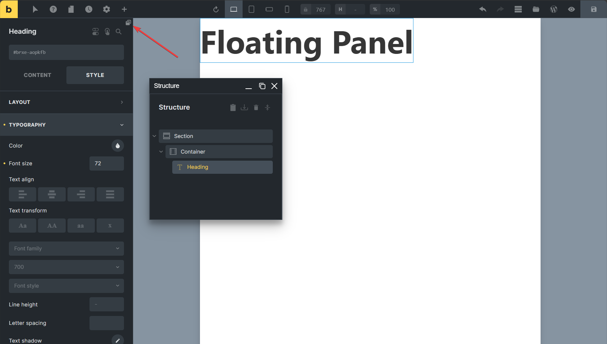

# Yabe Open Source - Bricks Floating Panel

    <a aria-label="GitHub release (latest by date including pre-releases)" href="https://github.com/yabe-open-source/bricks-floating-panel/releases">
        <picture>
            
        </picture>
    </a>
    <a aria-label="GitHub Sponsors" href="https://github.com/sponsors/suabahasa">
        <picture>
            
        </picture>
    </a>
    <a aria-label="Support me on Ko-fi" href="https://ko-fi.com/Q5Q75XSF7">
        <picture>
            
        </picture>
    </a>
    <a aria-label="Join Our Facebook community" href="https://www.facebook.com/groups/1142662969627943">
        <picture>
            
        </picture>
    </a>

Let the structure and main panel float around the Bricks editor by leveraging the power of [WinBox.js](https://nextapps-de.github.io/winbox/).

## Installation

1. Download the plugin zip file
2. Install the plugin by uploading the zip file
3. Activate the plugin

## Usage

1. Open the Bricks editor
2. Click the floating panel button on the top right corner of the Stucture or Main panel

3. Drag the float panel around the Bricks editor

## License

[GPL-3.0](./LICENSE)

## Credits

- [WinBox.js](https://nextapps-de.github.io/winbox/)
- [Lodash](https://lodash.com)
- [Sindre Sorhus - on-change](https://github.com/sindresorhus/on-change)